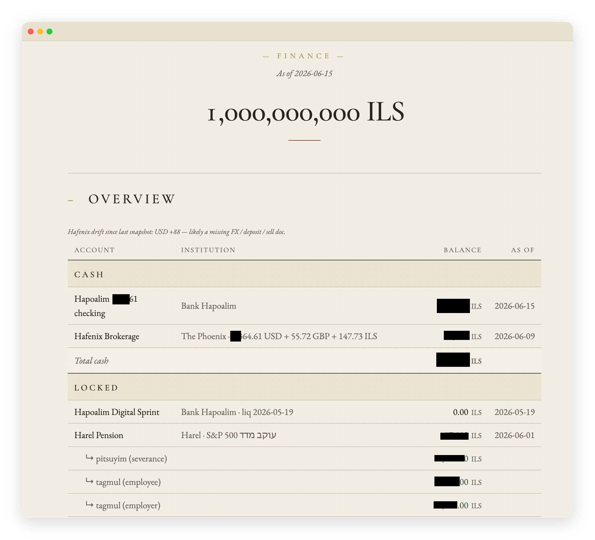
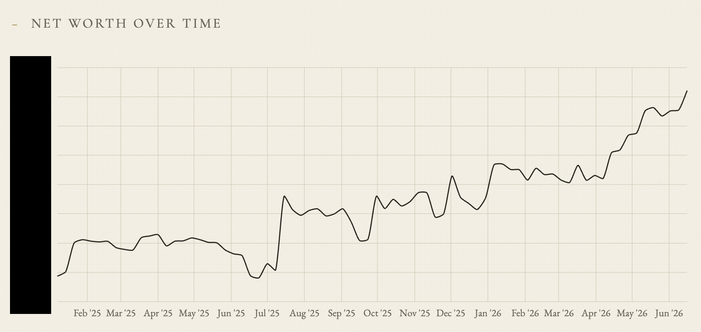
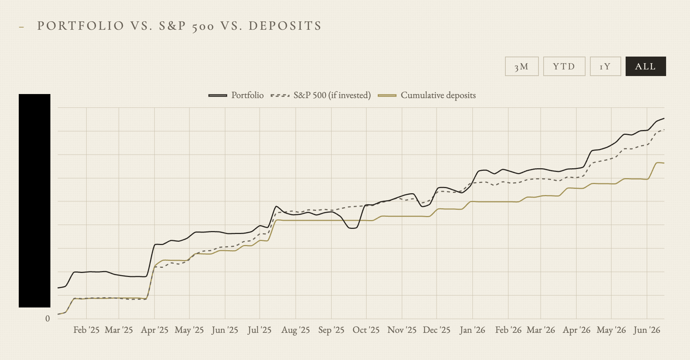
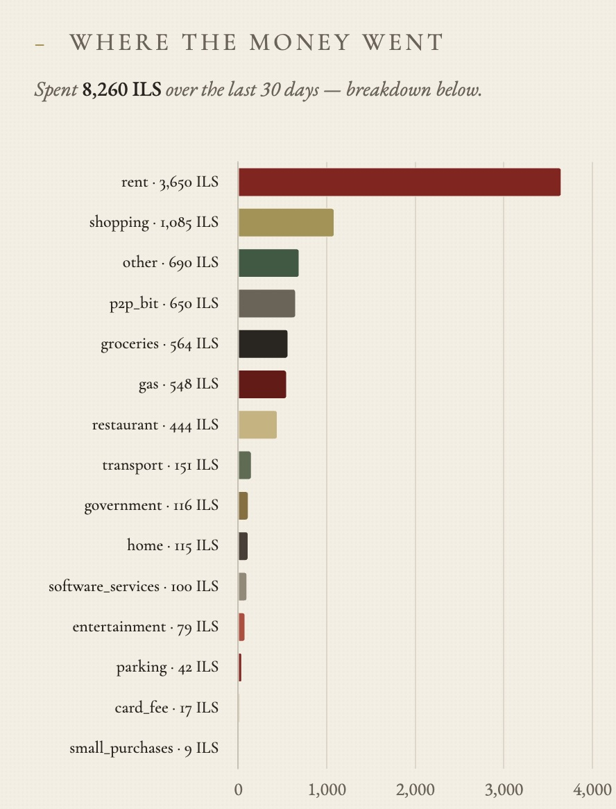
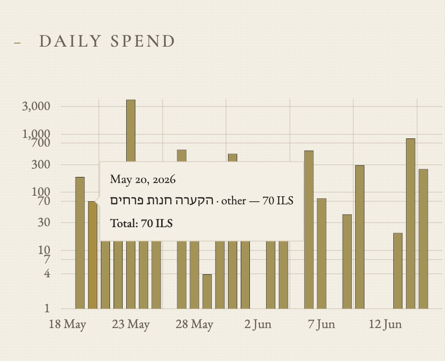
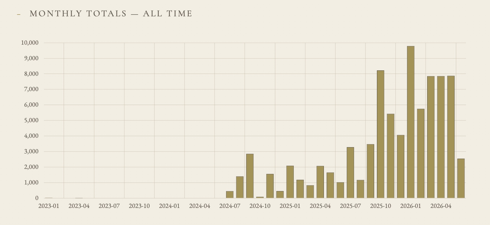
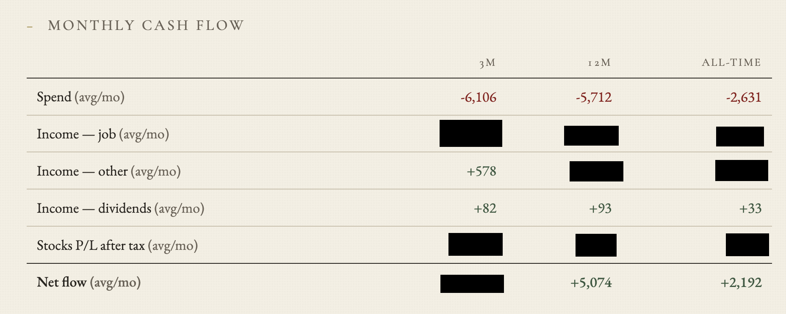
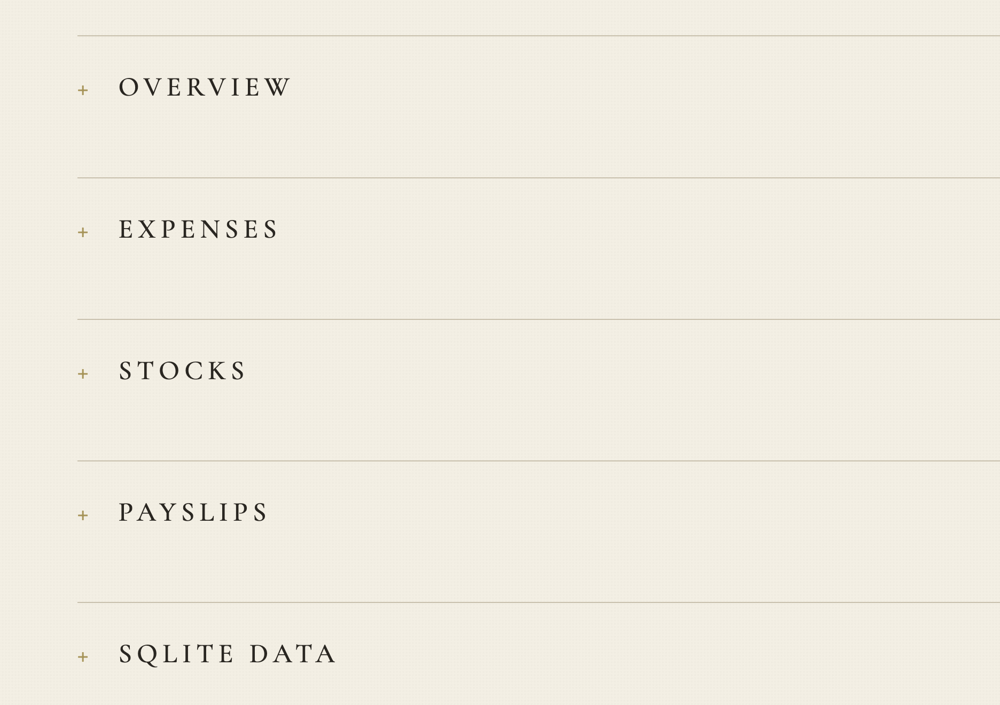
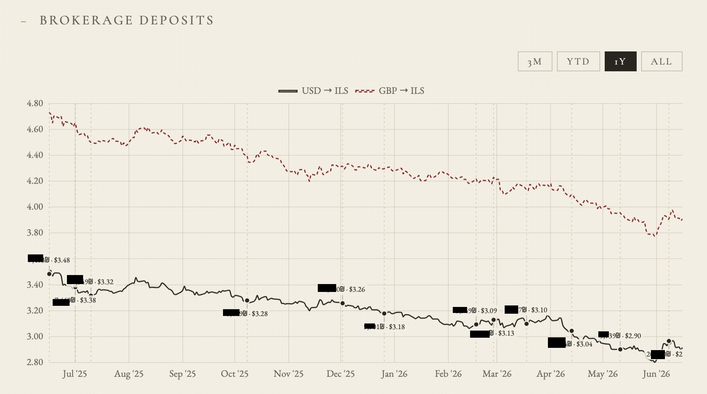

# FinDash

Claude skills for turning personal finance documents into an accurate SQLite-backed dashboard.

<p align="center">
  
</p>

<p align="center">
  
  
  
  
</p>

FinDash is a set of Claude Code project skills plus a small deterministic toolchain. The skills reason over messy real-world finance records like bank statements, payslips, brokerage screenshots, deposits, transfers, and card charges. The scripts do the mechanical work: parse files, update SQLite, fetch prices, render HTML, and optionally send the result as a Telegram dashboard.

Telegram delivery is useful but optional; the dashboard is always written locally as HTML. Automatic bank/card fetching is useful but optional. The core loop is: put source documents in a Google Drive vault, ask Claude to sync them into SQLite, then render a self-contained dashboard.

## What It Does

<table>
  <tr>
    <td width="50%">
      
    </td>
    <td width="50%">
      
    </td>
  </tr>
  <tr>
    <td><strong>Net worth over time</strong><br>Cash, locked savings, pension, training fund, and brokerage value roll into one view.</td>
    <td><strong>Investment benchmark</strong><br>Brokerage performance is compared with cumulative deposits and an S&P 500 what-if line.</td>
  </tr>
</table>

<table>
  <tr>
    <td width="50%">
      
    </td>
    <td width="50%">
      
    </td>
  </tr>
  <tr>
    <td><strong>Expense breakdown</strong><br>Merchant-level credit-card rows and bank transactions are grouped into real spending categories.</td>
    <td><strong>Daily spend</strong><br>Recent spending is visible without opening a bank app or spreadsheet.</td>
  </tr>
</table>

<table>
  <tr>
    <td width="50%">
      
    </td>
    <td width="50%">
      
    </td>
  </tr>
  <tr>
    <td><strong>Monthly totals</strong><br>Long-running monthly expense history, including quiet months and spikes.</td>
    <td><strong>Monthly cash flow</strong><br>Average spend, income, and net flow are summarized across short, yearly, and all-time windows.</td>
  </tr>
</table>

<table>
  <tr>
    <td width="50%">
      
    </td>
    <td width="50%">
      
    </td>
  </tr>
  <tr>
    <td><strong>Sectioned dashboard</strong><br>Overview, expenses, stocks, payslips, and SQLite data stay separated for quick scanning.</td>
    <td><strong>Brokerage deposits</strong><br>Deposit timing is shown against USD/ILS and GBP/ILS movement.</td>
  </tr>
</table>

## How It Works

```text
                          +----------------------+
                          | Claude Code skills   |
                          | .claude/skills/*     |
                          +----------+-----------+
                                     |
                                     v
                          +----------------------+
                          | Google Drive vault   |
                          | dump/                |
                          +----------+-----------+
                                     ^
                 manual upload       |        automatic fetch
        statements / PDFs / XLSX ----+---- fresh Hapoalim + Cal data
                                              fetch-bank-data

                                     |
                                     v
                          +----------------------+
                          | sync-finance-data    |
                          | AI interpretation    |
                          | audited inserts      |
                          +----------+-----------+
                                     |
                                     v
                          +----------------------+
                          | SQLite               |
                          | deterministic math   |
                          +----------+-----------+
                                     |
                                     v
                          +----------------------+
                          | render dashboard     |
                          | HTML + Telegram      |
                          +----------------------+
```

`sync-finance-data` scans the Drive vault, reasons through each source document, inserts rows with source links into SQLite, and backs the database up to Drive. `render-finance-dashboard` reads SQLite, fetches live prices/FX, fills the template, and writes one portable HTML file.

The dashboard is self-contained: CSS, fonts, Chart.js, chart data, and markup are inlined into `output/dashboard.html`.

## The Skills

FinDash is designed to be operated through Claude Code skills:

| Skill | Required? | What it does |
|---|---:|---|
| `/sync-finance-data` | Yes | Reads the Drive vault, applies Claude's judgment to source documents, and writes audited rows into SQLite. |
| `/render-finance-dashboard` | Yes | Renders `output/dashboard.html` from SQLite and optionally sends it to Telegram. |
| `/fetch-bank-data` | Optional | Uses `israeli-bank-scrapers` to pull fresh Hapoalim and Cal data into Drive `dump/`. |
| `/findash-doctor` | Recommended | Audits local setup and auto-fixes safe missing pieces. |

Claude skills live in [`.claude/skills/`](.claude/skills). Claude Code discovers project skills from this directory when you run `claude` from the repo root.

## Privacy Model

This repo is designed so the public code can be shared while private financial state stays local or in your Drive vault.

Secrets live in small local files:

```text
.secrets/drive       # root_folder_id=<Drive folder ID>
.secrets/telegram    # bot_token=... / chat_id=...
.secrets/hapoalim    # user_code=... / password=...
.secrets/cal         # username=... / password=...
.secrets/pdf-passwords
```

The committed docs use placeholders for account suffixes, card suffixes, Drive IDs, balances, transaction IDs, and example amounts. Concrete mappings belong in the private SQLite DB or source documents, not in git.

When you run the Claude skills, Claude reads the documents needed for the task. That is the point of the system: Claude supplies the judgment layer, while SQLite and scripts provide the audit trail and repeatable math.

## Repo Map

```text
docs/                 project docs: schema, Drive layout, source document types
scripts/              mechanical parsers, scrapers, renderers, daily runner
templates/            dashboard shell, CSS, and chart code
.claude/skills/       agent workflows for fetch, sync, render, and doctor
data/                 local SQLite database, gitignored
inbox/                transient downloads, gitignored
output/               rendered dashboard, gitignored
```

## Quickstart

For the full setup, read [docs/setup.md](docs/setup.md). The short version:

1. Install and authenticate [Claude Code](https://code.claude.com/docs/en/setup), then run `claude` from this repo root.
2. Install required local tools:

```bash
python3 --version
rclone version
sqlite3 --version
```

3. Create a Google Drive finance vault and configure `rclone` remote `gdrive`. See [Drive + rclone setup](docs/setup.md#3-connect-google-drive-with-rclone) and [Drive layout](docs/drive-layout.md).
4. Create local secrets:

```text
.secrets/drive       # required: root_folder_id=<Drive folder ID>
.secrets/telegram    # optional: bot_token=... / chat_id=...
.secrets/hapoalim    # optional: user_code=... / password=...
.secrets/cal         # optional: username=... / password=...
.secrets/pdf-passwords
```

5. Bundle dashboard assets once:

```bash
python3 scripts/bundle-assets.py
```

6. Run the setup doctor:

```text
/findash-doctor
```

7. Run the core workflow:

```text
/sync-finance-data
/render-finance-dashboard
```

Add `/fetch-bank-data` before sync only if you configured the optional bank fetch setup.

For unattended daily runs, use:

```bash
CLAUDE_BIN="$(command -v claude)" scripts/run_daily.sh
```

## Optional Integrations

- Telegram: sends `output/dashboard.html` as a bot attachment. Without Telegram, rendering still writes the local dashboard. See [Telegram setup](docs/setup.md#telegram-optional).
- Automatic bank/card fetch: pulls Hapoalim and Cal data through `israeli-bank-scrapers`. Without it, manually upload statements or exports into Drive `dump/`. See [Bank fetch setup](docs/setup.md#automatic-bank-fetch-optional).
- Password-protected payslips: requires `qpdf` and `.secrets/pdf-passwords`. Without it, skip payslip PDFs or add the password file later.

## Docs

- [Setup](docs/setup.md) — Claude, rclone, Drive vault, Telegram, bank fetch, daily runs.
- [Drive layout](docs/drive-layout.md) — vault folders and filename conventions.
- [Document types](docs/doc-types.md) — what each source document contains and how Claude should interpret it.
- [SQLite schema](docs/sqlite-schema.md) — tables, money conventions, and audit rules.
- [Design system](docs/design-system.md) — dashboard visual rules.

## License

No open-source license is currently granted. All rights are reserved by the repository owner.
