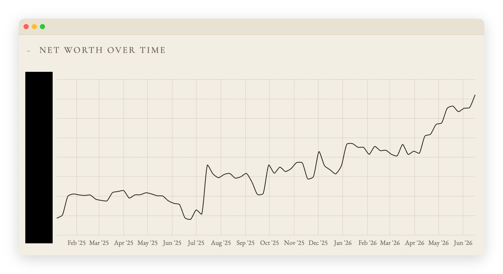
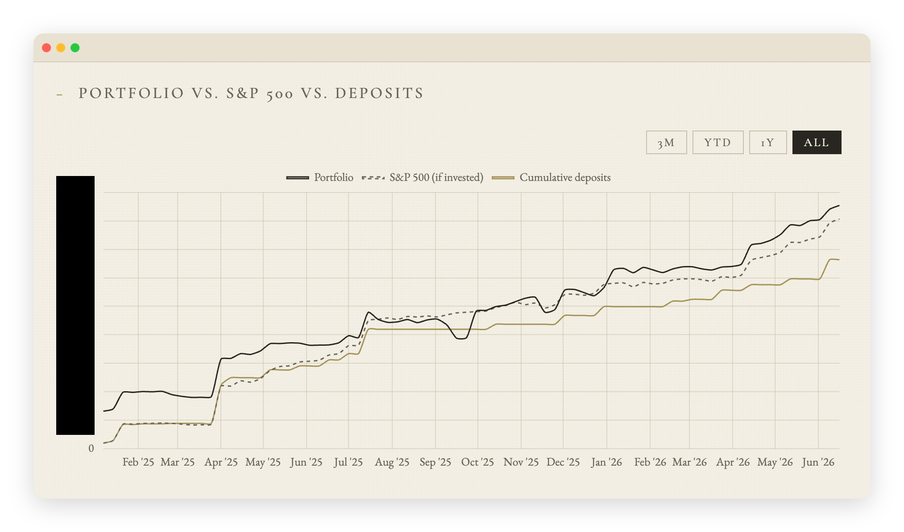
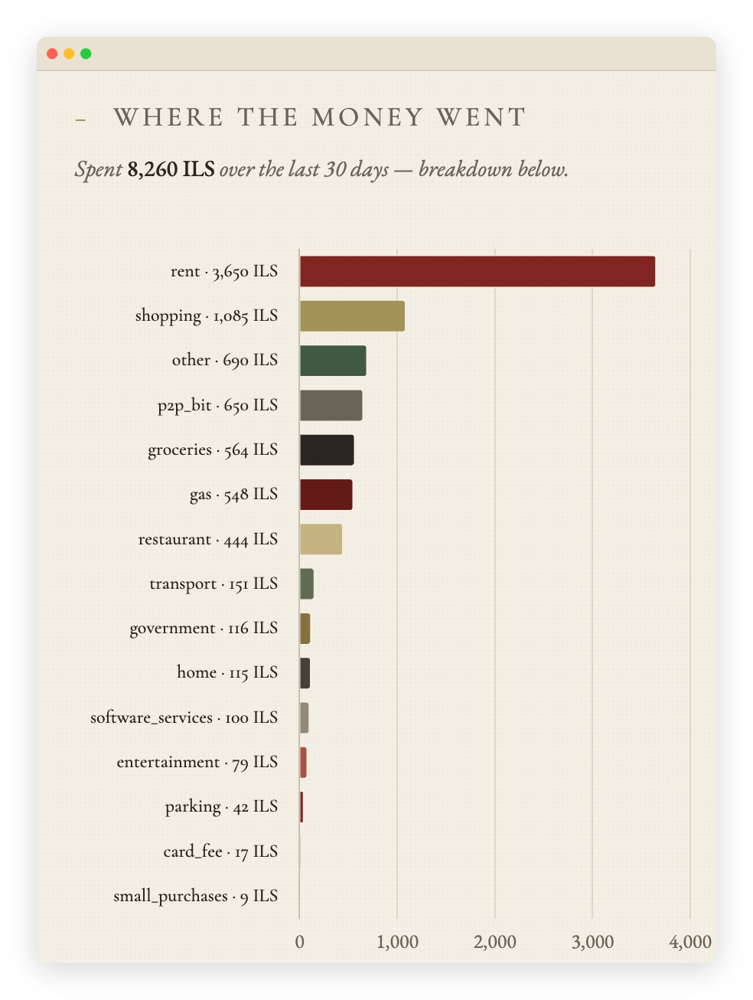
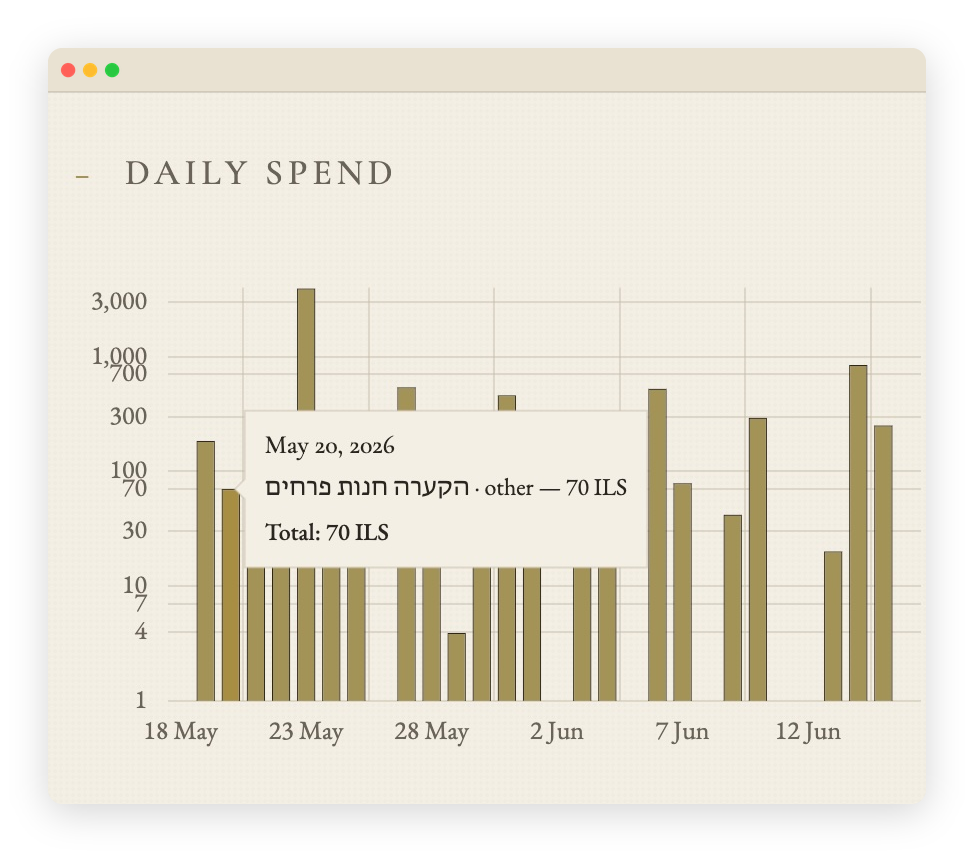
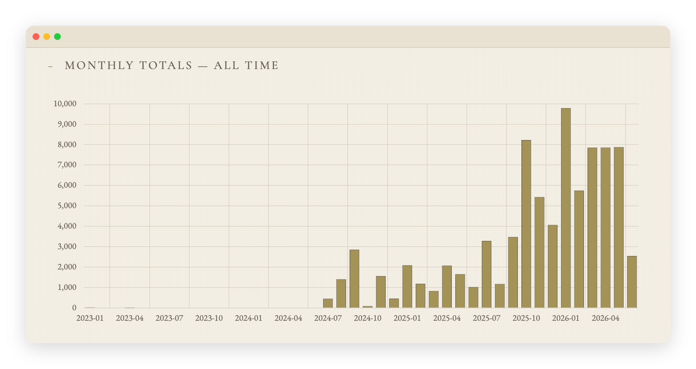
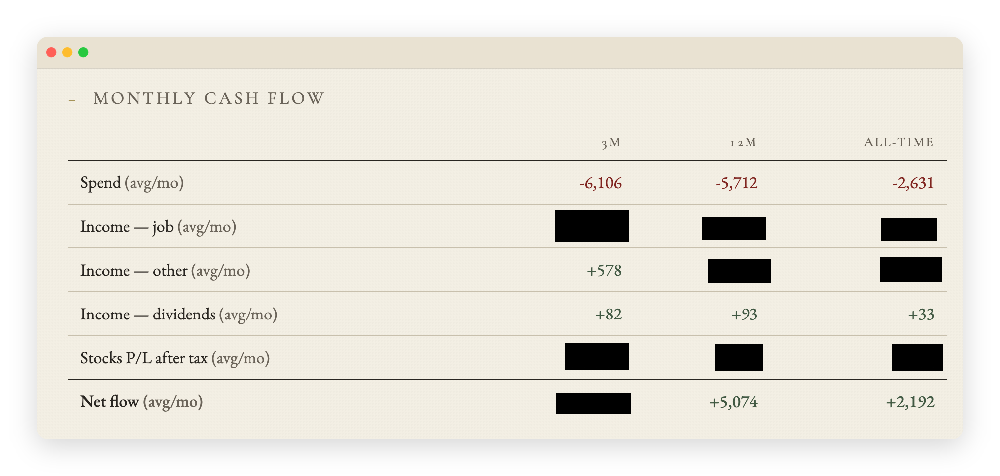
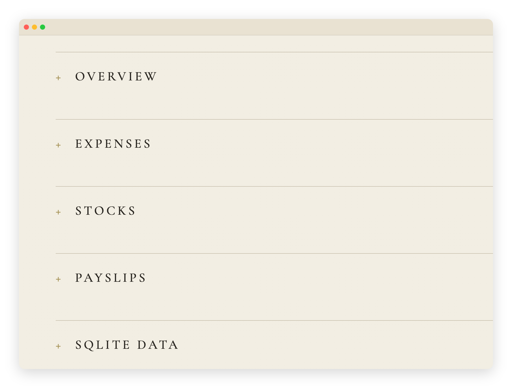
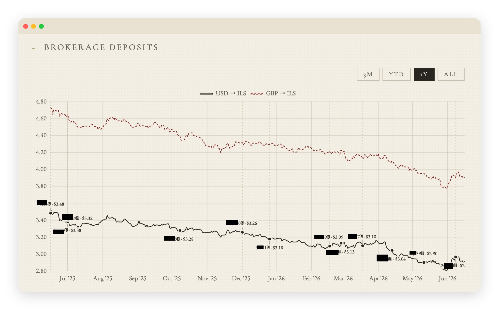

# FinDash

A Claude Code plugin for turning personal finance documents into an accurate SQLite-backed dashboard.

<p align="center">
  
</p>

<p align="center">
  
  
  
  
  
</p>

FinDash is a Claude Code plugin (`findash`) bundling a set of skills plus a small deterministic toolchain:

- **Skills reason** over messy real-world records — bank statements, payslips, brokerage screenshots, deposits, transfers, card charges.
- **Scripts do the mechanics** — parse files, update SQLite, fetch prices, render HTML, send to Telegram.

The core loop: drop source documents in a Google Drive vault → ask Claude to sync them into SQLite → render a self-contained dashboard. Telegram delivery and automatic bank/card fetch are both optional; the dashboard is always written locally as HTML.

> [!NOTE]
> **Built for Israel.** FinDash ships tuned for Israeli personal finance: automatic fetch covers **Bank Hapoalim** and **Cal** (via `israeli-bank-scrapers`), money reports in **₪ (ILS)**, the dashboard applies the **25% Israeli capital-gains tax** to securities profit, and the schema models Israeli **payslips** (income tax, Bituach Leumi) and **retirement vehicles** (pension + training fund / קרן השתלמות). Dates parse as **DD/MM** and Hebrew/RTL text is handled throughout. Many docs, prompts, and examples assume this locale.
>
> **Living elsewhere?** Nothing is locked in — fork it and swap the locale-specific pieces. See [Adapting to another country](#adapting-to-another-country).

## What It Does

<table>
  <tr>
    <td width="50%">
      
    </td>
    <td width="50%">
      
    </td>
  </tr>
  <tr>
    <td><strong>Net worth over time</strong><br>Cash, locked savings, pension, training fund, and brokerage value roll into one view.</td>
    <td><strong>Investment benchmark</strong><br>Brokerage performance is compared with cumulative deposits and an S&P 500 what-if line.</td>
  </tr>
</table>

<table>
  <tr>
    <td width="50%">
      
    </td>
    <td width="50%">
      
    </td>
  </tr>
  <tr>
    <td><strong>Expense breakdown</strong><br>Merchant-level credit-card rows and bank transactions are grouped into real spending categories.</td>
    <td><strong>Daily spend</strong><br>Recent spending is visible without opening a bank app or spreadsheet.</td>
  </tr>
</table>

<table>
  <tr>
    <td width="50%">
      
    </td>
    <td width="50%">
      
    </td>
  </tr>
  <tr>
    <td><strong>Monthly totals</strong><br>Long-running monthly expense history, including quiet months and spikes.</td>
    <td><strong>Monthly cash flow</strong><br>Average spend, income, and net flow are summarized across short, yearly, and all-time windows.</td>
  </tr>
</table>

<table>
  <tr>
    <td width="50%">
      
    </td>
    <td width="50%">
      
    </td>
  </tr>
  <tr>
    <td><strong>Sectioned dashboard</strong><br>Overview, expenses, stocks, payslips, and SQLite data stay separated for quick scanning.</td>
    <td><strong>Brokerage deposits</strong><br>Deposit timing is shown against USD/ILS and GBP/ILS movement.</td>
  </tr>
</table>

## How It Works

```text
                          +----------------------+
                          | findash plugin       |
                          | skills/* (/findash:) |
                          +----------+-----------+
                                     |
                                     v
                          +----------------------+
                          | Google Drive vault   |
                          | dump/                |
                          +----------+-----------+
                                     ^
                 manual upload       |        automatic fetch
        statements / PDFs / XLSX ----+---- fresh Hapoalim + Cal data
                                              fetch-bank-data

                                     |
                                     v
                          +----------------------+
                          | sync-finance-data    |
                          | AI interpretation    |
                          | audited inserts      |
                          +----------+-----------+
                                     |
                                     v
                          +----------------------+
                          | SQLite               |
                          | deterministic math   |
                          +----------+-----------+
                                     |
                                     v
                          +----------------------+
                          | render dashboard     |
                          | HTML + Telegram      |
                          +----------------------+
```

`sync-finance-data` scans the Drive vault, reasons through each source document, inserts rows with source links into SQLite, and backs the database up to Drive. `render-finance-dashboard` reads SQLite, fetches live prices/FX, fills the template, and writes one portable HTML file.

The dashboard is self-contained: CSS, fonts, Chart.js, chart data, and markup are inlined into `output/dashboard.html`.

## The Skills

FinDash is operated through the plugin's namespaced skills. The two new entry points wrap the rest, so most days you only run one:

| Skill | Required? | What it does |
|---|---:|---|
| `/findash:daily-run` | Entry point | Runs the whole morning flow end-to-end: fetch → sync → render → deliver to Telegram. This is what the cron wrapper invokes. |
| `/findash:setup` | Entry point | Guided first-time onboarding: auto-fixes the safe pieces and walks you through the rest. |
| `/findash:sync-finance-data` | Yes | Reads the Drive vault, applies Claude's judgment to source documents, and writes audited rows into SQLite. |
| `/findash:render-finance-dashboard` | Yes | Renders `output/dashboard.html` from SQLite and optionally sends it to Telegram. |
| `/findash:fetch-bank-data` | Optional | Uses `israeli-bank-scrapers` to pull fresh Hapoalim and Cal data into Drive `dump/`. |
| `/findash:fetch-investments` | Optional · interactive | Ingests your Interactive Brokers trade history (plus a reconcile snapshot) into SQLite via the official IBKR connector. Hands-on only — not part of the unattended daily run. |
| `/findash:findash-doctor` | Recommended | Audits local setup and auto-fixes safe missing pieces. |

Skills live in [`skills/`](skills) and the plugin manifest in [`.claude-plugin/`](.claude-plugin). Claude Code loads them when you run `claude --plugin-dir .` from the repo root.

## Privacy Model

This repo is designed so the public code can be shared while private financial state stays local or in your Drive vault.

Secrets live in a single local INI file, `.secrets/findash` (chmod 600), with one section per integration. Omit any section you don't use:

```ini
# .secrets/findash — chmod 600. Omit any section you don't use.
[drive]
root_folder_id=<from your vault folder's Drive URL: drive.google.com/drive/folders/<ID>>

[hapoalim]
user_code=<your hapoalim user code>
password=<your hapoalim password>

[cal]
username=<your cal username>
password=<your cal password>

[telegram]
bot_token=<from @BotFather>
chat_id=<your numeric id, from @userinfobot>

[pdf-passwords]
<payslip-filename-pattern>=<password>
```

`rclone.conf` stays a separate file — it is rclone's own OAuth config, passed via `--config ./rclone.conf`.

The committed docs use placeholders for account suffixes, card suffixes, Drive IDs, balances, transaction IDs, and example amounts. Concrete mappings belong in the private SQLite DB or source documents, not in git.

When you run the Claude skills, Claude reads the documents needed for the task. That is the point of the system: Claude supplies the judgment layer, while SQLite and scripts provide the audit trail and repeatable math.

## Repo Map

```text
.claude-plugin/       plugin + marketplace manifests
skills/               plugin skills: daily-run, setup, fetch, sync, render, doctor
docs/                 project docs: schema, Drive layout, source document types
scripts/              mechanical parsers, scrapers, renderers, daily runner
templates/            dashboard shell, CSS, and chart code
.secrets/findash      single local INI of credentials, gitignored
data/                 local SQLite database, gitignored
inbox/                transient downloads, gitignored
output/               rendered dashboard, gitignored
```

## Quickstart

For the full setup, read [docs/setup.md](docs/setup.md). The short version:

1. Install and authenticate [Claude Code](https://code.claude.com/docs/en/setup) and the local tools:

```bash
qpdf --version          # payslip PDFs
rclone version          # Drive sync
node --version          # bank fetch, needs >=22.13.0
python3 --version
sqlite3 --version
```

2. Clone this repo and load the plugin from its root:

```bash
git clone https://github.com/ya5huk/findash.git
cd findash
claude --plugin-dir .
```

3. Run the guided onboarding — it auto-fixes the safe pieces and walks you through the rest:

```text
/findash:setup
```

4. Create `.secrets/findash` (chmod 600) from the single block in [Privacy Model](#privacy-model). Omit any section you don't use. `rclone.conf` stays separate; see [Drive + rclone setup](docs/setup.md#3-connect-google-drive-with-rclone) and [Drive layout](docs/drive-layout.md).

5. Run the whole flow with one command:

```text
/findash:daily-run
```

This fetches, syncs, renders, and delivers to Telegram. To run pieces by hand, use `/findash:fetch-bank-data`, `/findash:sync-finance-data`, and `/findash:render-finance-dashboard`.

For unattended (cron/launchd) daily runs, schedule the wrapper — it loads the plugin and runs `/findash:daily-run`:

```bash
CLAUDE_BIN="$(command -v claude)" scripts/run_daily.sh
```

If you want unattended runs to fetch from Hapoalim or Cal, seed the browser profiles once before scheduling:

```bash
node scripts/fetch_bank.js --company=hapoalim --setup
node scripts/fetch_bank.js --company=visaCal --setup
```

In each browser window, log in, complete OTP/CAPTCHA, trust the device if
offered, wait for the account page, then press Enter in the terminal. If a bank
sends an OTP during a later unattended run, rerun the matching `--setup`
command; the run will continue with stale fetched data until the profile is
refreshed.

### Install as a plugin (for others)

You don't have to clone to use FinDash. From any Claude Code session:

```text
/plugin marketplace add ya5huk/findash
/plugin install findash@findash
```

## Optional Integrations

- Telegram: sends `output/dashboard.html` as a bot attachment. Without Telegram, rendering still writes the local dashboard. See [Telegram setup](docs/setup.md#telegram-optional).
- Automatic bank/card fetch: pulls Hapoalim and Cal data through `israeli-bank-scrapers`. Unattended fetch requires a one-time interactive `--setup` per source to seed trusted-device cookies. Without it, manually upload statements or exports into Drive `dump/`. See [Bank fetch setup](docs/setup.md#automatic-bank-fetch-optional).
- Password-protected payslips: requires `qpdf` and a `[pdf-passwords]` section in `.secrets/findash`. Without it, skip payslip PDFs or add the passwords later.
- Interactive Brokers: ingests your IBKR **trade history** onto a mapped account (so you stop screenshotting trades), plus a reconciliation snapshot, via Anthropic's official **IBKR connector** — added through Claude's connector directory, not findash config. Interactive-only: run `/findash:fetch-investments` by hand (then re-render); it is not part of the unattended daily run. See [IBKR setup](docs/setup.md#interactive-brokers-ibkr-portfolio-optional).

## Adapting to another country

FinDash is Israel-first, not Israel-only. The data model, scripts, and dashboard are generic; the locale-specific assumptions are concentrated in a handful of places, so a fork can re-point them without rewriting the core:

| Area | Where it's assumed | Swap it for |
|---|---|---|
| **Banks / card fetch** | `scripts/fetch_bank.js`, the `[hapoalim]`/`[cal]` secrets, and `fetch-bank-data` | Your country's banks — `israeli-bank-scrapers` covers many Israeli institutions, or wire in another scraper/aggregator. |
| **Capital-gains tax** | `ISRAELI_CAPGAINS_TAX = 0.25` in `scripts/render_dashboard.py`; the 25% dividend withholding in `sync-finance-data` | Your jurisdiction's rate(s). |
| **Base currency** | `BASE_CCY = "ILS"` in `scripts/render_dashboard.py`; the `USD/ILS` & `GBP/ILS` FX pairs; `en-IL` number formatting | Your reporting currency and FX pairs. |
| **Payslips & retirement** | `docs/doc-types/payslips.md`, `long-term-savings.md`, and the pension / training-fund columns in `scripts/init-db.sql` | Your payroll deductions and retirement products (401(k)/IRA, ISA, etc.). |
| **Dates & language** | DD/MM ambiguity handling in `scripts/xlsx_to_rows.py`; Hebrew/RTL handling in the templates and renderer | Your locale's date format and language. |

Most interpretation lives in the skills' prompts rather than hard-coded rules, so re-pointing those plus the constants above gets you most of the way. PRs that generalize these are welcome — see [Contributing](CONTRIBUTING.md).

## Docs

- [Setup](docs/setup.md) — Claude, rclone, Drive vault, Telegram, bank fetch, daily runs.
- [Drive layout](docs/drive-layout.md) — vault folders and filename conventions.
- [Document types](docs/doc-types/README.md) — what each source document contains and how Claude should interpret it.
- [SQLite schema](docs/sqlite-schema.md) — tables, money conventions, and audit rules.
- [Design system](docs/design-system.md) — dashboard visual rules.

## License

No open-source license is currently granted. All rights are reserved by the repository owner.
